# Computer Vision tasks with YOLO

In robot perception, four common vision tasks are typically
used:

-   Image Classification
-   Object Detection
-   Image Segmentation
-   Pose Estimation

These tasks progressively increase spatial understanding of the scene.

## Image Classification

Image classification assigns **one label per image**.

Example:

Input image → `STOP sign`

Used when only the object type matters, not its position.

Typical robotics use: - traffic sign recognition - object category
filtering - simple scene understanding

In our traffic‑sign project we use **classification**, because each
frame contains a single relevant sign.


## Object Detection

Object detection identifies:

-   object class
-   object position
-   bounding box coordinates

Example:

`STOP sign → (x, y, w, h)`

Useful when multiple objects appear simultaneously.

Typical robotics use:

-   obstacle detection
-   people detection
-   multi‑sign navigation


Detection could be added later to our project using datasets annotated
with tools such as **Roboflow**.


## Image Segmentation

Segmentation assigns a **class label to each pixel** in the image.

Instead of bounding boxes, it produces masks.

Typical robotics use:

-   road detection
-   hand contour extraction
-   grasp planning
-   environment mapping


Segmentation provides higher spatial precision but requires more
computation.

## Pose Estimation

Pose estimation detects **keypoints of articulated bodies**, typically
humans.

Example:

-   shoulders
-   elbows
-   wrists
-   knees

Typical robotics use:

-   gesture recognition
-   human‑robot interaction
-   hand tracking
-   collaborative robotics


Pose estimation is useful for interaction tasks such as detecting a
handshake or a raised hand.

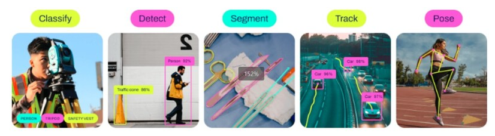

Image from: https://www.dfrobot.com/blog-13844.html


## YOLO

YOLO (You Only Look Once) is a family of real-time object detection models based on deep learning.

We use Yolo because:

-   it runs in real time
-   it works well on CPU systems
-   it supports classification, detection, segmentation and pose
    estimation
-   it integrates easily with ROS 2 pipelines

Alternative frameworks exist:

-   Detectron2
-   Faster R‑CNN
-   EfficientDet
-   RT‑DETR

However, YOLO provides the best balance between speed, simplicity, and
accuracy for robotics education.

| Year | Version | Main improvement                                    |
| ---- | ------- | --------------------------------------------------- |
| 2015 | YOLOv1  | First real-time object detection model              |
| 2016 | YOLOv2  | Improved accuracy and localization                  |
| 2018 | YOLOv3  | Multi-scale object detection                        |
| 2020 | YOLOv4  | Better training techniques and performance          |
| 2020 | YOLOv5  | PyTorch implementation (easy to train and use)      |
| 2022 | YOLOv6  | Optimized for industrial applications               |
| 2023 | YOLOv8  | Anchor-free detection and multi-task support        |
| 2024 | YOLO11  | Higher efficiency and better small-object detection |
| 2025 | YOLO26  | Unified detection pipeline without NMS              |


## Ultralytics

Ultralytics is a Python library for training and running YOLO-based computer vision models.

We use **Ultralytics Python library** because it:

-   simplifies training workflows
-   supports custom datasets
-   exports `.pt` models easily
-   runs efficiently on embedded platforms
-   integrates well with real‑time camera pipelines


Bibliography:
- [Yolo](https://www.dfrobot.com/blog-13844.html)
- [Ultralytics](https://github.com/ultralytics/ultralytics)
- [Training model](https://docs.ultralytics.com/es/usage/python/#how-do-i-train-a-custom-yolo-model-using-my-dataset)
- [Roboflow](https://roboflow.com/)


## Installation
````bash
py -3.11 -m pip install ultralytics
py -3.11 -m pip uninstall numpy
py -3.11 -m pip install "numpy<2.0"
py -3.11 -m pip install pillow
py -3.11 -m pip install opencv-python
````
> Chang the python version to agree with the one intalled in your computer

## **1. YOLO Model generation for Classification task**

For Traffic signs classification we will use the YOLO11 model, that is a pre-trained model.
- You need an initial structure:
````python
photos/
├── Stop/
├── Right/
├── Left/
├── Give/
├── Nothing/
└── Forbidden/
````
- Now you have to make photos (around 200) for each traffic sign with different positions, ilumination, environment, etc
    - If you want to use your computer webcam: 
        - open terminal in `/photos/Stop` folder, for exemple and
        - run `1_capture_images.py`
    - If you want to use the rUBot camera: 
        - Create a ROS2 node to read Images from `/image_raw` topic and save in speciffic folder (1_capture_images_from_topic.py)
        - In a new terminal execute:
        ````bash
        py -3.11 1_capture_images_from_topic.py
        ````
        - verify the topic name and change OUTPUT_RELATIVE_PATH for each signal
- First step is to resize to a 640x640 file format in a new structure, with the code `2_prepare_dataset.py`:
````python
traffic_sign_dataset/
├── train/
│   ├── Stop/
│   ├── Right/
│   ├── Left/
│   ├── Give/
│   ├── Nothing/
│   └── Forbidden/
└── val/
    ├── Stop/
    ├── Right/
    ├── Left/
    ├── Give/
    ├── Nothing/
    └── Forbidden/
````
> See the value: TRAIN_RATIO = 0.80   # 80% train, 20% val
- Train a classification model with `3_generate_model.py`
- the model will be generated in: `runs/classify/train/weights/best.pt`
- **To test the model prediction** with the classification model `best.pt`:
    - Using your computer webcam:
        - Verify on `4_classify_camera.py` python code MODEL_PATH and execute it
    - If you want to use the rUBot camera: 
        - Create a ROS2 node to read Images from `/image_raw` topic and classify in real-time using the previously generated model (4_classify_camera_from_topic.py)
        - In a new terminal execute:
        ````bash
        py -3.11 4_classify_camera_from_topic.py
        ````
        - verify the topic name and MODEL_PATH

## **2. YOLO Model generation for Identification task**

To properly label signs in the images and train a model we will use "roboflow":
- Open a new google tab: https://roboflow.com/
    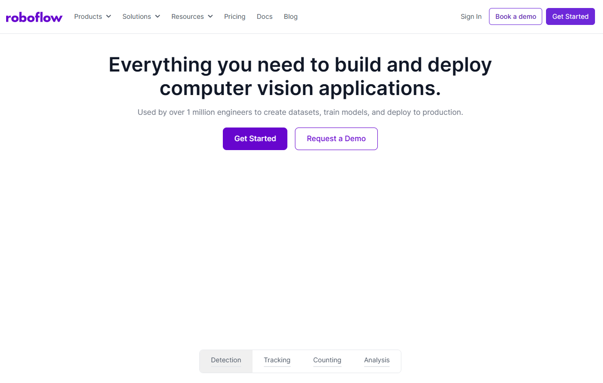
- Select "Get Started" or "Sign In" and "Continue with Google"
- Select a Name of the workspace (i.e. TrafficSignals)
- Select "Public Plan"
- You will have a maximum of 4 invites available for your project partners to collaborate in the model generation. We suggest a role of "Admin" for Invite team members
- Create a workspace
- Answer some objective questions
- Select "What type of model would you like to deploy?". Type "Object Detection"
    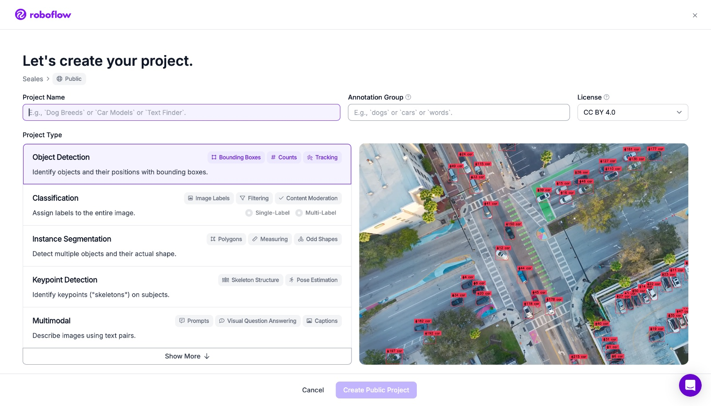
- There is a short Roboflow tutorial video: https://blog.roboflow.com/getting-started-with-roboflow/

- Create a project in our created "Workspace":
    - Select Projects and choose ``new project``, choose a name and click on `Continue with Public`
        
    - Select `Use Traditional Model Builder Instead` to have whole control of YOLO model in Robotic projects
    - You have 5 different classes: Stop, Right, Left, Give, Forbidden
    - You will have in your local PC one folder per Class with the different photos you have taken previously.
    -Choose `Select Folder` to upload pictures from a local folder. Upload all the images on this project.
        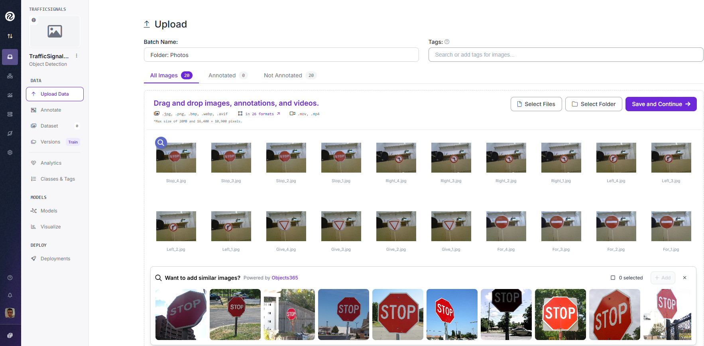
    - Type ``save&continue`` and ``start labeling`` to label all traffic signs pictures
    - You can assign some pictures to different Invited team members
    - Select ``start anotating``. You will do it for each Class.
        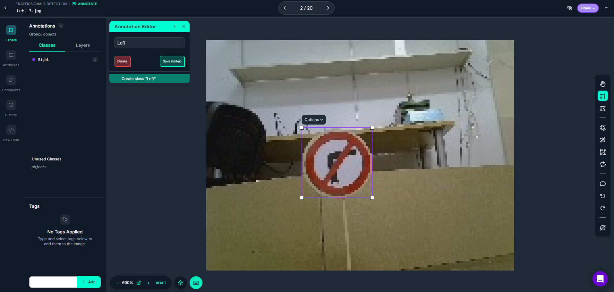
    - If you make an error, type ``layers`` 3point menu and change class
        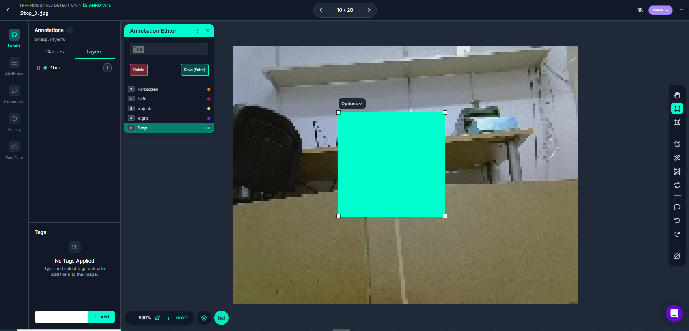
    - When finished go back (left corner arrow) and select ``add xx images to Dataset``.
    - Select Method ``use existing values`` and press ``add images``
    - Select ``train model`` and ``custom training``
    - Edit ``train test/split`` select ``balance`` (select % of training (80%) / Validating (15%) / Test (5%))
        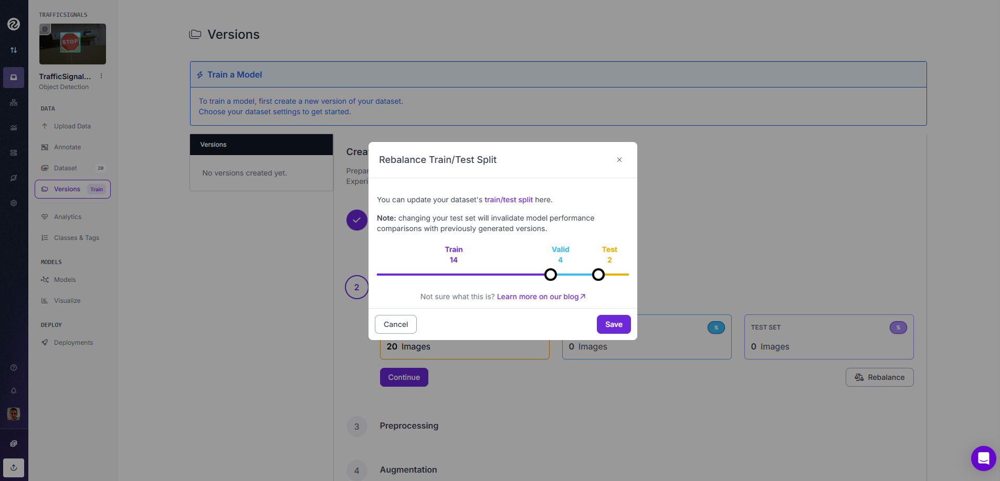
    - select ``continue`` for the other options
    - select ``augmentation`` and ``shear`` to proper consider rotations in x and y axis
        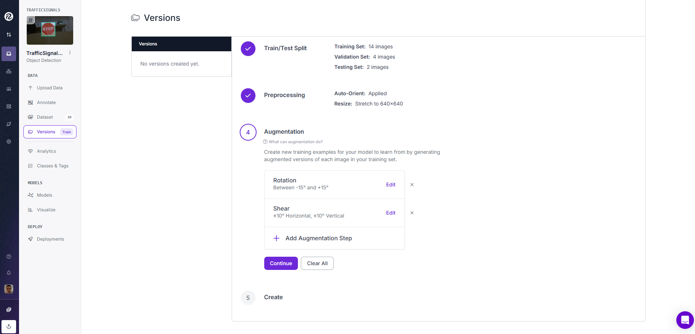
    - type ``create``
    - type ``download Data set`` choose format ``yolov8`` and ``Download zip to computer``. Save this zip file to your computer. This contains images (for train, valid and test) and data.yaml used in the next section to obtain the final model.

 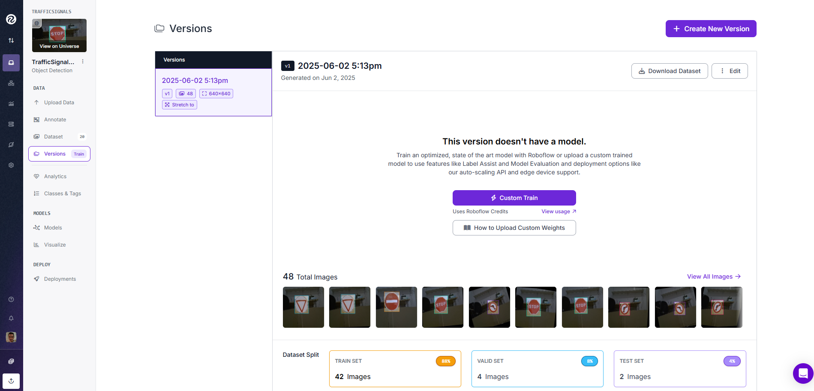   

- **To test the model prediction** with the identification model `yolov8n_identification_signals.pt`:
    - Using your computer webcam:
        - Verify on `5_identify_camera.py` python code the MODEL_PATH and execute it
    - If you want to use the rUBot camera: 
        - Verify in `5_identify_camera_from_topic.py` the topic and MODEL_PATH
        - In a new terminal execute:
        ````bash
        py -3.11 5_identify_camera_from_topic.py
        ````


## **3. Pose Estimation**

Pose estimation detects **keypoints of articulated bodies**, typically
humans.

- Open a terminal in `YOLO_model_generation`
- execute the python program:
    ````pythpn
    py -3.11 6_pose_gesture_camera.py
    ````

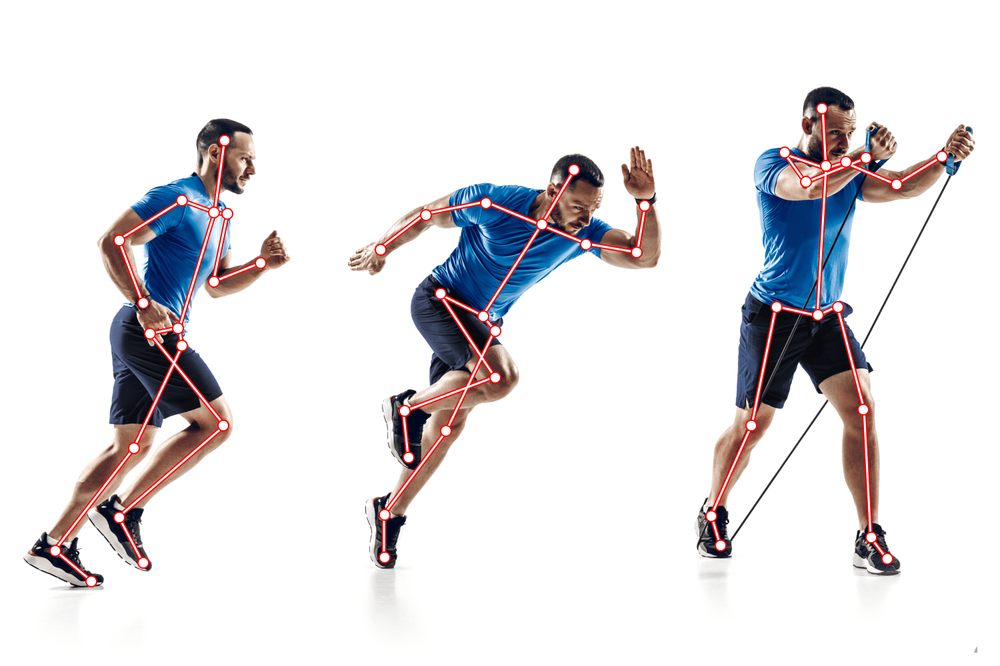
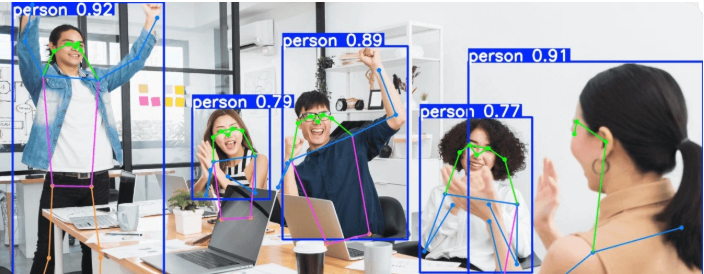