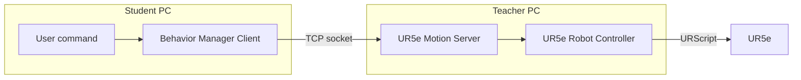

# Lab 1 — Social Motion with Python Sockets and URScript

## 1. Objective

In this laboratory you will create and execute a simple **social motion** for a UR5e robot using:

- Python;
- TCP sockets;
- YAML motion files;
- URScript.

Examples of social motions include:

- waving;
- handshake;
- give five;
- inviting a person;
- pointing;
- celebrating.

You will:

1. create a new YAML motion;
2. test it at home;
3. give the final YAML file to the instructor;
4. execute it in the laboratory using a client–server architecture.

---

## 2. Client–server architecture

The system is divided into two parts.

### Student PC

The student runs:

```text
main.py
command_interpreter.py
behavior_manager_client.py
```

The client reads the requested behavior and sends the motion request through a TCP socket.

### Teacher PC

The teacher runs:

```text
ur5e_motion_server.py
ur5e_robot_controller.py
```

The server receives the request and sends the corresponding URScript commands to the UR5e.



---

## 3. Student task

Create one original social motion.

The movement must:

- have a clear social meaning;
- contain several poses;
- start from a safe configuration;
- use slow and smooth movements;
- avoid joint limits and unsafe poses;
- finish in a safe configuration.

Create the YAML file in:

```text
motions/
```

Use a descriptive name:

```text
wave.yaml
invite_person.yaml
show_agreement.yaml
```

Do not use spaces or capital letters.

### Register the new motion in the client

Creating the YAML file is not enough for the prepared voice client to find it. Add an entry to `behavior_manager_client.py`:

```python
MOTIONS = {
    "init": "motions/init.yaml",
    "hand_shake": "motions/handshake.yaml",
    "give5": "motions/give5.yaml",
    "wave": "motions/wave.yaml",
}
```

If the motion must be requested by voice, also add a phrase to `command_interpreter.py` that returns the same command name:

```python
if "wave" in text:
    return "wave"
```

The command name, the dictionary key, and the YAML filename must agree. The YAML filename includes `.yaml`; the command sent by the client is the key without the extension.

---

## 4. YAML motion format

Use an existing YAML file as a reference.

Example:

```yaml
sequence_name: wave

steps:
  - name: approach
    motion: moveL
    target_xyz_mm: [-300, -300, 300]
    target_rpy_deg: [90, 0, 0]
    velocity: 0.10
    acceleration: 0.50
    time: 3.0
    blend: 0.0
```

Recommended structure:

```text
safe initial pose
        ↓
social gesture
        ↓
optional repetition
        ↓
safe final pose
```

---

# Part A — Home development

## 5. Local test

At home, both client and server can run on the same computer.

Use:

```text
SERVER_IP = 127.0.0.1
```

### Terminal 1 — Start the server

```bash
cd ~/UR5e_social_robotics/Python_sockets_Robotic_project

python3 ur5e_motion_server.py
```

### Terminal 2 — Start the client

```bash
cd ~/UR5e_social_robotics/Python_sockets_Robotic_project

python3 main.py
```

Select or request your behavior.

Example:

```text
robot wave
```

The expected flow is:

```text
command
    ↓
behavior name
    ↓
YAML file
    ↓
TCP request
    ↓
motion server
```

The server starts RoboDK in `simulation_only` mode and executes the received YAML there. Students can therefore inspect the movement visually without connecting to the real robot.

The existing client recognizes `robot give me five` and `robot shake my hand`. The `robot wave` example works only after registering `wave` in `behavior_manager_client.py` and adding the corresponding voice rule to `command_interpreter.py`.

---

## 6. Home verification checklist

Before coming to the laboratory, verify that:

- the YAML file is valid;
- all required fields are present;
- the client can load the motion;
- the server receives the request;
- the complete sequence is executed;
- the motion starts and finishes safely;
- velocities and accelerations are low.

Submit or bring the final YAML file to the instructor.

---

# Part B — Laboratory execution

## 7. Instructor verification

Before using the real UR5e, the instructor:

1. reviews the YAML file;
2. checks the robot poses;
3. verifies velocity and acceleration values;
4. confirms that the workspace is safe;
5. authorizes execution.

The first execution must always be supervised.

---

## 8. Network configuration

The Student PC and Teacher PC must be connected to the same network.

### Teacher PC

The server listens on the network interface:

```python
SERVER_IP = "0.0.0.0"
SERVER_PORT = 5000
```

### Student PC

The client must use the Teacher PC IP:

```python
SERVER_IP = "<TEACHER_PC_IP>"
SERVER_PORT = 5000
```

Verify connectivity:

```bash
ping <TEACHER_PC_IP>
```

---

## 9. Start the system

### Teacher PC — Terminal 1

Start the motion server:

```bash
cd ~/UR5e_social_robotics/Python_sockets_Robotic_project

python3 ur5e_motion_server.py
```

The Teacher PC is also connected to the UR5e.

### Student PC — Terminal 1

Start the client application:

```bash
cd ~/UR5e_social_robotics/Python_sockets_Robotic_project

python3 main.py
```

The student requests the validated behavior.

Example:

```text
robot wave
```

---

## 10. Safety rules

Before execution:

- obtain instructor authorization;
- check that the robot workspace is clear;
- remain outside the robot workspace;
- know the emergency stop location;
- use reduced speed;
- never execute an unverified YAML file;
- keep one person ready to stop the robot.

---

## 11. Expected execution flow

```text
Student PC
main.py
    ↓
command_interpreter.py
    ↓
behavior_manager_client.py
    ↓ TCP socket

Teacher PC
ur5e_motion_server.py
    ↓
ur5e_robot_controller.py
    ↓ URScript
UR5e
```

---

## 12. Deliverables

Submit:

1. the YAML motion file;
2. a short description of its social meaning;
3. evidence of home testing;
4. evidence of laboratory execution;
5. a brief comparison between expected and real behavior.

---

## 13. Discussion questions

1. Why is a client–server architecture useful in this laboratory?
2. Why should the robot server run on the Teacher PC?
3. Why must the YAML file be verified before execution?
4. What are the main differences between Python sockets and ROS 2 services?
5. What limitations does direct URScript control have compared with MoveIt 2?
