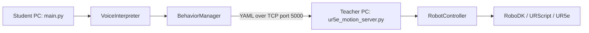

# Python sockets architecture

This document explains how the Python sockets environment is built and how to verify it. The laboratory activity is described in `5_ROS2_SocialRobotics_Project.md`.

## Architecture



The main components are:

- `main.py`: starts the voice interface and the client.
- `command_interpreter.py`: converts speech into a behavior name.
- `behavior_manager_client.py`: selects a YAML file and sends it by TCP.
- `ur5e_motion_server.py`: receives requests and manages client connections.
- `ur5e_robot_controller.py`: executes the sequence in RoboDK and/or the UR5e.

Only `main.py` and `ur5e_motion_server.py` are entry points. Do not start `ur5e_robot_controller.py` separately.

## Installation

Install RoboDK and the Python dependencies on any computer used for local client-server verification:

```bash
cd ~/UR5e_social_robotics/Python_sockets_Robotic_project
python3 -m pip install -r requirements.txt
```

On Ubuntu, microphone and text-to-speech support may also require:

```bash
sudo apt install portaudio19-dev python3-pyaudio espeak-ng
```

Voice recognition uses the Google recognition service and requires Internet access.

## Configuration

Set the Teacher PC address in `config.py` on the Student PC:

```python
SERVER_IP = "<TEACHER_PC_IP>"
SERVER_PORT = 5000
```

Select the execution mode in `ur5e_robot_controller.py`:

```python
EXECUTION_MODE = "simulation_only"
```

Available modes are `simulation_only`, `simulation_and_real`, and `real_only`.

## Local verification

Run both programs from `Python_sockets_Robotic_project`, using two terminals.

Terminal 1 — server:

```bash
python3 ur5e_motion_server.py
```

Terminal 2 — client:

```bash
python3 main.py
```

For a local test, use `SERVER_IP = "127.0.0.1"`. A successful request produces an `OK: sequence executed` response.

For two computers, first verify the connection:

```bash
ping <TEACHER_PC_IP>
```

## Adding a behavior

Follow these steps to add your own social motion. In this example, the new behavior is called `wave`.

### 1. Create the motion file

Copy an existing YAML file, rename it, and save it in:

```text
Python_sockets_Robotic_project/motions/wave.yaml
```

Edit `sequence_name` and the list of `steps`. Every step must use one of these motion types:

- `moveJ`: requires six joint values in `joints_deg`.
- `moveL`: requires `target_xyz_mm` and `target_rpy_deg`, with three values each.

Use the existing `init.yaml`, `handshake.yaml`, and `give5.yaml` files as templates. Keep velocities and accelerations low, and finish in a safe pose.

### 2. Register the behavior

Add the behavior and its file to the `MOTIONS` dictionary in `behavior_manager_client.py`:

```python
MOTIONS = {
    "init": "motions/init.yaml",
    "hand_shake": "motions/handshake.yaml",
    "give5": "motions/give5.yaml",
    "wave": "motions/wave.yaml",
}
```

The key `wave` is the internal behavior name. The YAML extension is used only in the file path.

### 3. Add the voice command

In `command_interpreter.py`, add the accepted phrases before `return "unknown"`:

```python
if any(k in text for k in [
    "wave",
    "wave your hand",
    "say hello"
]):
    return "wave"
```

The returned value must be exactly the same as the key in `MOTIONS`. With the current activation word, the student can then say `robot wave`.

### 4. Verify the new behavior

1. Set `EXECUTION_MODE = "simulation_only"` in `ur5e_robot_controller.py`.
2. Start `ur5e_motion_server.py` in one terminal.
3. Start `main.py` in another terminal.
4. Request the new behavior and check that the server returns `OK: sequence executed`.
5. Observe the complete motion in RoboDK and correct unsafe or abrupt poses.

Do not change to `simulation_and_real` or `real_only` until the motion has been validated and approved by the instructor.
