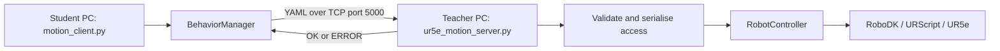
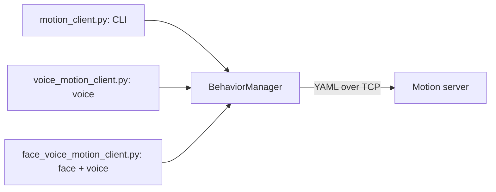

# Python sockets architecture

This document explains the custom TCP client-server architecture used in the first project session. The activity and deliverables are described in `5_ROS2_SocialRobotics_Project.md`.

## Learning objectives

Students should be able to:

1. identify the client, server, IP address, TCP port, request, and response;
2. describe a complete UR5e motion sequence in YAML and send it through TCP;
3. explain why centralising validation and robot access is safer and more controlled than direct access from every Student PC;
4. identify the limitations of a custom socket protocol and compare it with ROS 2;
5. recognise that command-line, voice, and face-and-voice interfaces can share the same communication layer.

## Core architecture

The required activity uses the command-line client. Voice recognition and face verification are optional HRI extensions.



The main components are:

- `motion_client.py`: command-line entry point that selects a registered motion;
- `behavior_manager_client.py`: resolves the name, validates its YAML locally, opens the TCP connection, sends the complete YAML, and reads the response;
- `ur5e_motion_server.py`: receives and parses YAML, prevents concurrent robot execution, and returns `OK` or `ERROR`;
- `ur5e_robot_controller.py`: executes the sequence in RoboDK and/or the UR5e;
- `motions/*.yaml`: declarative sequences containing `moveJ` and `moveL` steps.

Only `motion_client.py` and `ur5e_motion_server.py` are required entry points. Do not start `ur5e_robot_controller.py` separately.

## What crosses the socket

The command-line argument is a local behavior name:

```bash
python3 motion_client.py handshake
```

The client resolves that name through `MOTIONS` and sends the corresponding YAML file contents. It does not give the Student PC direct control of the UR5e.

```yaml
sequence_name: wave
steps:
  - name: initial_pose
    motion: moveJ
    joints_deg: [0, -90, 90, -90, -90, 0]
    velocity: 0.10
    acceleration: 0.50
  - name: greeting_pose
    motion: moveL
    target_xyz_mm: [-300, -300, 300]
    target_rpy_deg: [90, 0, 0]
    velocity: 0.10
    acceleration: 0.50
```

The TCP exchange is:

```text
client                                      server
  | connect(teacher_ip, 5000)                 |
  |------------------------------------------>|
  | send complete YAML                        |
  |------------------------------------------>|
  | shutdown write side                       |
  |------------------------------------------>|
  |                         validate + execute|
  |<---------------- OK or ERROR -------------|
  | close                                     |
```

Closing the write side marks the end of the request. This is a deliberately simple application protocol for learning purposes.

## Installation

Install the core dependencies:

```bash
cd ~/UR5e_social_robotics/Python_sockets_Robotic_project
python3 -m pip install -r requirements.txt
```

Optional voice interface:

```bash
python3 -m pip install -r requirements_voice.txt
```

Optional face-and-voice interface:

```bash
python3 -m pip install -r requirements_face.txt
```

On Ubuntu, microphone and text-to-speech support may also require:

```bash
sudo apt install portaudio19-dev python3-pyaudio espeak-ng
```

Voice recognition uses Google recognition and requires Internet access. The laboratory PCs are prepared for the optional HRI tests.

## Configuration

Set the Teacher PC address in `config.py` on the Student PC:

```python
SERVER_IP = "<TEACHER_PC_IP>"
SERVER_PORT = 5000
```

Select the execution mode in `ur5e_robot_controller.py`:

```python
EXECUTION_MODE = "simulation_only"
```

Available modes are `simulation_only`, `simulation_and_real`, and `real_only`.

## Local verification

Use two terminals and `SERVER_IP = "127.0.0.1"`.

Terminal 1 -- server:

```bash
python3 ur5e_motion_server.py
```

Terminal 2 -- inspect and run the client:

```bash
python3 motion_client.py --list
python3 motion_client.py init
```

A successful request produces `OK: sequence executed`. Also observe local rejection of an unknown name:

```bash
python3 motion_client.py does_not_exist
```

For two computers, first run `ping <TEACHER_PC_IP>`, configure the Teacher PC address, and use the same client commands.

## Adding a behavior

### 1. Create the motion file

Create `motions/wave.yaml`. Every step must use:

- `moveJ`, with six joint values in `joints_deg`; or
- `moveL`, with three values in `target_xyz_mm` and `target_rpy_deg`.

Use `init.yaml`, `handshake.yaml`, and `give5.yaml` as templates. Keep velocities and accelerations low, and finish in a safe pose.

### 2. Register the behavior

Add it to `MOTIONS` in `behavior_manager_client.py`:

```python
MOTIONS = {
    "init": "motions/init.yaml",
    "handshake": "motions/handshake.yaml",
    "give5": "motions/give5.yaml",
    "wave": "motions/wave.yaml",
}
```

The dictionary key is the command-line name:

```bash
python3 motion_client.py wave
```

### 3. Verify the behavior

1. Set `EXECUTION_MODE = "simulation_only"`.
2. Start `ur5e_motion_server.py`.
3. Confirm that `wave` appears with `python3 motion_client.py --list`.
4. Run `python3 motion_client.py wave`.
5. Inspect the response and complete motion in RoboDK.
6. Correct unsafe, invalid, or abrupt poses before requesting approval.

Do not use a real execution mode until the motion has been validated and approved by the instructor.

## Optional HRI interfaces

The HRI and TCP layers are intentionally decoupled:



Run voice control with:

```bash
python3 voice_motion_client.py
```

`VoiceInterpreter` maps a phrase such as `robot give me five` to the same `give5` key registered in `MOTIONS`. Add new accepted phrases in `command_interpreter.py`.

For face verification, save a clear reference image at `REFERENCE_FACE_IMAGE` in `config.py`, then run:

```bash
python3 face_voice_motion_client.py
```

Face verification only controls access to the voice interface. It does not change the YAML, TCP protocol, server, or robot controller. These interfaces are optional because cameras, microphones, `dlib`, and online speech recognition can fail independently of the socket architecture.

## Limitations and transition to ROS 2

Centralising robot access in the Teacher PC is more controlled than direct access from every Student PC. The server validates requests, prevents simultaneous execution, and provides one supervised access point. However, this custom application has limitations:

- IP address and port are configured manually;
- YAML messages have no versioned, formally typed network interface;
- request framing depends on closing the write side;
- the client receives only a final response, without progress feedback;
- an executing request cannot be cancelled through this protocol;
- discovery, inspection, logging, and interoperability must be implemented manually;
- the socket itself provides no motion planning or collision checking.

ROS 2 does not remove the client-server pattern. In the next session it replaces the custom protocol with standard ROS 2 communication and integrates MoveIt 2. Students can compare manual TCP sockets with typed interfaces, node discovery, standard inspection tools, and robot-aware planning. ROS 2 actions can also provide progress feedback and cancellation when required.
