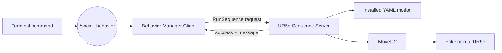
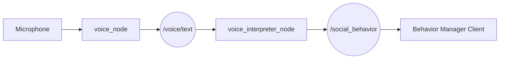
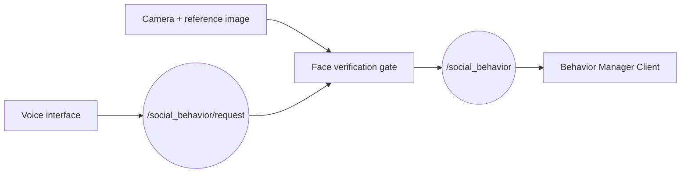

# ROS 2 architecture

This document explains the ROS 2 solution used in the second project session. It deliberately follows the same workflow as the previous Python-sockets session so that both architectures can be compared. The complete activity and deliverables are described in `5_ROS2_SocialRobotics_Project.md`.

## Learning objectives

Students should be able to:

1. send the same high-level motion request used in the sockets session;
2. identify ROS 2 nodes, topics, services, requests, and responses;
3. explain how the Behavior Manager separates the command interface from robot execution;
4. execute and validate a complete YAML sequence with fake hardware and MoveIt 2;
5. compare a custom YAML-over-TCP protocol with ROS 2 discovery, typed interfaces, inspection tools, and MoveIt 2;
6. extend the command source with optional voice recognition and face verification without modifying the motion server.

## Comparison with the sockets session

The student performs the same conceptual operation in both sessions: request a named behavior and observe its execution and result.

| Stage | Python sockets | ROS 2 |
|---|---|---|
| Manual command | `python3 motion_client.py handshake` | publish `handshake` on `/social_behavior` |
| Student-side component | `BehaviorManager` | `behavior_manager_client_node` |
| Communication | custom TCP, port 5000 | ROS 2 topic and typed service |
| Request sent to server | complete YAML text | `RunSequence(sequence_name)` |
| Motion file | sent by the client | installed on the server |
| Execution | RoboDK / URScript | MoveIt 2 / UR driver |
| Result | text `OK` or `ERROR` | typed success flag and message |

The ROS 2 version still uses a client-server responsibility boundary. It replaces the custom network protocol and adds standard ROS 2 communication and robot integration.

## Core architecture

The required activity starts with a terminal publisher. Voice and face verification remain optional HRI input layers.



### Behavior Manager Client

`behavior_manager_client_node`, from `social_robot_behaviors`:

1. subscribes to `/social_behavior` using `std_msgs/msg/String`;
2. validates the behavior name;
3. creates a typed `RunSequence` request;
4. calls `/ur5e/run_sequence` asynchronously;
5. reports whether the server accepted or rejected the sequence.

The topic message `handshake` becomes:

```text
RunSequence.Request(sequence_name="handshake")
```

The service interface is:

```text
string sequence_name
---
bool success
string message
```

### UR5e Sequence Server

`ur5e_sequence_server`, from `ur5e_motion_server`:

1. provides `/ur5e/run_sequence`;
2. resolves the requested name to an installed YAML file;
3. rejects invalid names, missing files, and requests received while busy;
4. launches the sequence controller;
5. returns a typed success or error response.

The YAML is resolved from the installed `ur5e_robot_controller` package, normally:

```text
~/UR5e_social_robotics/install/ur5e_robot_controller/share/ur5e_robot_controller/config/
```

Unlike the sockets version, the client sends only the behavior name. The server must already contain the approved YAML file.

## Build the workspace

On Ubuntu:

```bash
cd ~/UR5e_social_robotics
colcon build --symlink-install
source install/setup.bash
```

Source the workspace in every new ROS 2 terminal. Install the ROS 2 and Universal Robots dependencies described in `1_UR5e_setup.md`.

## Required execution: terminal command

The following procedure mirrors `motion_client.py handshake` from the sockets session.

Terminal 1 -- fake UR5e driver:

```bash
ros2 launch ur_robot_driver ur_control.launch.py \
  ur_type:=ur5e robot_ip:=192.168.0.20 \
  use_fake_hardware:=true launch_rviz:=false
```

Terminal 2 -- MoveIt 2 and RViz:

```bash
ros2 launch ur_moveit_config ur_moveit.launch.py \
  ur_type:=ur5e launch_rviz:=true
```

Terminal 3 -- sequence server:

```bash
ros2 run ur5e_motion_server ur5e_sequence_server
```

Terminal 4 -- Behavior Manager Client:

```bash
ros2 launch social_robot_behaviors social_behavior.launch.py
```

Terminal 5 -- command source:

```bash
ros2 topic pub --once /social_behavior std_msgs/msg/String \
  "{data: 'handshake'}"
```

Expected flow:

```text
handshake
    -> /social_behavior
    -> RunSequence request
    -> server finds handshake.yaml
    -> MoveIt 2 plans and executes
    -> success/error response
```

## Inspect and validate the communication

ROS 2 makes each part observable:

```bash
ros2 node list
ros2 topic list
ros2 topic info /social_behavior --verbose
ros2 topic echo /social_behavior
ros2 service list
ros2 service type /ur5e/run_sequence
ros2 interface show ur5e_interfaces/srv/RunSequence
```

Validation checklist:

1. `/social_behavior` has the expected publisher and subscriber.
2. `/ur5e/run_sequence` has one server and the Behavior Manager client.
3. The client logs the received behavior and service response.
4. The server logs the resolved YAML path and execution result.
5. RViz shows the complete planned motion.
6. Unknown behavior names and concurrent requests are rejected safely.

## Add and validate `wave`

Copy an existing ROS 2 motion:

```bash
cd ~/UR5e_social_robotics/src/ur5e_motion_utils/ur5e_robot_controller/config
cp handshake.yaml wave.yaml
```

Edit `wave.yaml` using millimetres for `target_xyz`, degrees for `target_rpy`, and low speed and acceleration values:

```yaml
common:
  execute: true
  group_name: ur_manipulator
  ik_link: tool0
  target_frame: table
  planning_frame: base_link
  max_velocity: 0.1
  max_acceleration: 0.1

steps:
  - name: wave_start
    target_xyz: [-250, -350, 400]
    target_rpy: [90.0, 0.0, 0.0]
    seed_from_joint_states: true
    duration: 3.0
    sleep_after: 1.0
```

Build again so the YAML is installed:

```bash
cd ~/UR5e_social_robotics
colcon build --symlink-install
source install/setup.bash
```

No source-code registration is required. Publish the filename without `.yaml`:

```bash
ros2 topic pub --once /social_behavior std_msgs/msg/String \
  "{data: 'wave'}"
```

Check the initial pose, every intermediate pose, the final pose, planning errors, collision warnings, and abrupt movements in RViz before requesting instructor approval.

## Optional HRI extension 1: voice commands

The `social_robot_hri` package can replace the terminal publisher without changing the Behavior Manager or sequence server:



On Ubuntu, install the voice dependencies:

```bash
sudo apt update
sudo apt install portaudio19-dev python3-pyaudio
python3 -m pip install -r \
  src/social_robot_hri/requirements_voice.txt
```

Then rebuild and launch:

```bash
colcon build --symlink-install --packages-select social_robot_hri
source install/setup.bash
ros2 launch social_robot_hri social_robot_hri.launch.py
```

Say, for example:

```text
robot handshake
robot give me five
robot home
```

The Google speech-recognition service requires Internet access. The activation word and recognition language are ROS parameters.

### Validate voice without moving the robot

First test only the topic pipeline. Do not start the motion server:

```bash
ros2 topic echo /social_behavior
```

Speech should produce exactly one valid behavior name. The interpreter can also be tested without a microphone or Internet connection:

```bash
ros2 run social_robot_hri voice_interpreter_node
```

In another terminal:

```bash
ros2 topic pub --once /voice/text std_msgs/msg/String \
  "{data: 'robot handshake'}"
```

Only after this test should the Behavior Manager, fake robot, and MoveIt 2 be started.

## Optional HRI extension 2: face verification and voice

Face verification acts as a gate between the interpreted request and `/social_behavior`:



The implementation adds these components to `social_robot_hri`:

- `face_verification_node.py`: performs camera face comparison, authorises the user once, and republishes approved requests;
- `face_voice_hri.launch.py`: starts voice recognition, interpretation, and the face gate.

Install the Ubuntu build dependencies and Python packages:

```bash
sudo apt update
sudo apt install build-essential cmake libopenblas-dev \
  portaudio19-dev python3-pyaudio python3-opencv
python3 -m pip install -r \
  src/social_robot_hri/requirements_face.txt
```

Use a clear frontal reference photograph and an absolute path:

```bash
ros2 launch social_robot_hri face_voice_hri.launch.py \
  reference_image:=/home/student/authorised_user.jpg \
  camera_index:=0
```

If the face matches, interpreted voice commands are forwarded to `/social_behavior`. Otherwise they remain blocked. This is an educational identity gate, not a secure biometric authentication system: it performs a single verification at startup and has no liveness detection.

### Validate face and voice safely

Before connecting the behavior client or robot:

1. run `ros2 topic echo /social_behavior`;
2. launch `face_voice_hri.launch.py`;
3. verify the authorised user and say `robot handshake`;
4. check that `handshake` appears on `/social_behavior`;
5. cancel or use a non-matching person and confirm that no command is forwarded;
6. repeat with fake hardware before any real-robot execution.

## Home simulation and classroom validation

The mandatory ROS 2 architecture and complete motion can be developed at home on Ubuntu using fake hardware, MoveIt 2, and RViz. No physical UR5e is required.

| Test | At home | In the laboratory |
|---|---|---|
| Topic and service inspection | Yes | Repeat briefly |
| YAML sequence with fake hardware | Yes, required | Confirm before real execution |
| Voice interpreter with synthetic `/voice/text` | Yes | Optional repeat |
| Real microphone recognition | Yes, if microphone and Internet are available | Recommended on prepared PCs |
| Face verification | Yes, if webcam and packages are available | Recommended on prepared PCs |
| Real UR5e motion | No | Only with instructor approval |

This layered validation separates HRI failures from ROS 2 communication and robot-motion failures.

## Send `wave.yaml` to the Teacher PC

After approval, copy only the YAML into:

```text
~/UR5e_social_robotics/install/ur5e_robot_controller/share/ur5e_robot_controller/config/
```

Use the prepared transfer program on the Student PC:

```bash
cd ~/UR5e_social_robotics/Documentation/Files/Send_motion
python3 send_social_motion.py
```

Check `PROFESSOR_IP`, `PROFESSOR_USER`, `LOCAL_FOLDER`, and `REMOTE_FOLDER`, then enter `wave.yaml`. The program uses `scp`; the remote user must have permission to write to the destination.

The server resolves the YAML for every request. After a successful copy, publish `wave` without rebuilding or restarting the sequence server.

## From custom sockets to ROS 2

The second session improves the implementation while preserving the responsibility boundary:

- ROS 2 discovers communication endpoints instead of using an application-specific IP and port in the client;
- `RunSequence` defines a typed request and response;
- ROS 2 CLI tools expose nodes, topics, services, types, and traffic;
- the server resolves approved motion files instead of accepting arbitrary YAML text over the network;
- MoveIt 2 adds robot-aware planning and collision checking;
- HRI input remains replaceable because it publishes the same high-level behavior topic.

The current service returns a final result but does not provide continuous feedback or cancellation. A future improvement would replace long-running sequence execution with a ROS 2 action.
