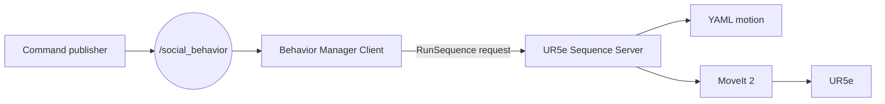

# ROS 2 architecture

This document explains the ROS 2 client-server architecture, how to execute an existing motion, and how to add a new one. The complete laboratory activity is described in `5_ROS2_SocialRobotics_Project.md`.

## Architecture



There is no voice interface in this ROS 2 example. The student publishes a behavior name from the terminal so that the topic and service communication can be observed directly.

## How the client works

The client is the `behavior_manager_client_node` from the `social_robot_behaviors` package.

1. It subscribes to the `/social_behavior` topic using `std_msgs/msg/String`.
2. It checks that the received name contains only letters, numbers, `_`, or `-`.
3. It creates a `RunSequence` service request with that behavior name.
4. It sends the request asynchronously to `/ur5e/run_sequence`.
5. It reports whether the server accepted or rejected the sequence.

For example, the topic message `handshake` becomes:

```text
RunSequence.Request(sequence_name="handshake")
```

The service interface is:

```text
string sequence_name
---
bool success
string message
```

## How the server works

The server is the `ur5e_sequence_server` node from the `ur5e_motion_server` package.

1. It provides the `/ur5e/run_sequence` service.
2. It receives the sequence name and adds `.yaml` if necessary.
3. It looks for the file in the installed `ur5e_robot_controller/config` directory.
4. It rejects invalid names, missing files, or requests received while the robot is busy.
5. It launches `ur5e_pose_sequence.launch.py` with the full YAML path.
6. The sequence node uses MoveIt 2 services and the trajectory controller to execute every pose.
7. The server returns a success or error response to the client.

The default server directory is resolved through the ROS 2 package index. It normally corresponds to:

```text
~/UR5e_social_robotics/install/ur5e_robot_controller/share/ur5e_robot_controller/config/
```

Unlike the Python sockets version, the ROS 2 client sends only the behavior name. The YAML file must already exist on the computer running the server.

## Build the workspace

```bash
cd ~/UR5e_social_robotics
colcon build --symlink-install
source install/setup.bash
```

Use a separate sourced terminal for every ROS 2 process. The ROS 2 and Universal Robots dependencies must be installed as described in `1_UR5e_setup.md`.

## Execute an existing motion

The following example executes the existing `handshake.yaml` motion using fake hardware.

Terminal 1 — fake UR5e driver:

```bash
ros2 launch ur_robot_driver ur_control.launch.py \
  ur_type:=ur5e robot_ip:=192.168.0.20 \
  use_fake_hardware:=true launch_rviz:=false
```

Terminal 2 — MoveIt 2 and RViz:

```bash
ros2 launch ur_moveit_config ur_moveit.launch.py \
  ur_type:=ur5e launch_rviz:=true
```

Terminal 3 — sequence server:

```bash
ros2 run ur5e_motion_server ur5e_sequence_server
```

Terminal 4 — Behavior Manager Client:

```bash
ros2 launch social_robot_behaviors social_behavior.launch.py
```

Terminal 5 — publish the command:

```bash
ros2 topic pub --once /social_behavior std_msgs/msg/String \
  "{data: 'handshake'}"
```

The filename is published without `.yaml`. The expected flow is:

```text
handshake → client request → server finds handshake.yaml → MoveIt 2 executes it
```

## Check the client-server communication

```bash
ros2 node list
ros2 topic info /social_behavior
ros2 service type /ur5e/run_sequence
```

The client terminal should show that `handshake` was received and requested. The server terminal should show the resolved YAML path and the execution result. RViz should display the planned robot motion.

## Add the new `wave` motion

### 1. Create the YAML file

Copy an existing ROS 2 motion as a template:

```bash
cd ~/UR5e_social_robotics/src/ur5e_motion_utils/ur5e_robot_controller/config
cp handshake.yaml wave.yaml
```

Edit `wave.yaml`. The `common` section defines the robot group, frames, speed, acceleration, and execution mode. Each entry under `steps` defines one pose:

```yaml
common:
  execute: true
  group_name: ur_manipulator
  ik_link: tool0
  target_frame: table
  planning_frame: base_link
  max_velocity: 0.1
  max_acceleration: 0.1

steps:
  - name: wave_start
    target_xyz: [-250, -350, 400]
    target_rpy: [90.0, 0.0, 0.0]
    seed_from_joint_states: true
    duration: 3.0
    sleep_after: 1.0
```

Add the remaining safe poses required for the waving gesture. Use `target_xyz` in millimetres, `target_rpy` in degrees, and low speed and acceleration values.

### 2. Build and test locally

Because the new YAML must be copied to the local `install/` space, build and source the workspace:

```bash
cd ~/UR5e_social_robotics
colcon build --symlink-install
source install/setup.bash
```

Start the fake driver, MoveIt 2, server, and client as shown above. Then publish:

```bash
ros2 topic pub --once /social_behavior std_msgs/msg/String \
  "{data: 'wave'}"
```

No source-code change is required: the client and server use the filename as the behavior name.

### 3. Validate the motion

Check the complete sequence in RViz, including its initial and final poses. Correct planning errors, collisions, abrupt movements, or unsafe poses before sending the file to the teacher.

## Send `wave.yaml` to the Teacher PC

After the teacher approves the motion, the student can copy only the YAML file into the installed package on the Teacher PC. This avoids rebuilding the server workspace.

The destination is:

```text
~/UR5e_social_robotics/install/ur5e_robot_controller/share/ur5e_robot_controller/config/
```

Run the prepared transfer program on the Student PC:

```bash
cd ~/UR5e_social_robotics/Documentation/Files/Send_motion
python3 send_social_motion.py
```

Before running it, check `PROFESSOR_IP`, `PROFESSOR_USER`, `LOCAL_FOLDER`, and `REMOTE_FOLDER` inside the program. When prompted, enter:

```text
wave.yaml
```

The program uses `scp`, so the Student PC must reach the Teacher PC through the network and the remote user must have write permission on the destination directory.

The server resolves the YAML path for every request. Therefore, after a successful copy, `wave` can be published without compiling or restarting `ur5e_sequence_server`:

```bash
ros2 topic pub --once /social_behavior std_msgs/msg/String \
  "{data: 'wave'}"
```

This transfer mechanism belongs here because it depends on how the ROS 2 server locates installed motion files. Document 5 keeps only the short laboratory workflow.
