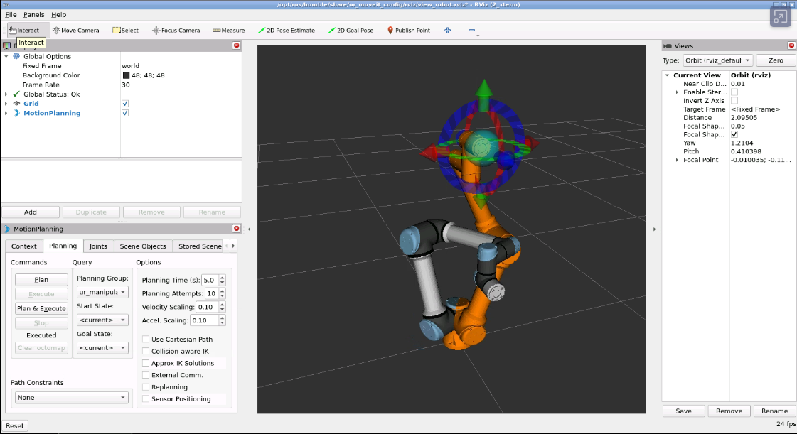

# UR5e Social Robotics: Distributed ROS 2 Classroom Practice

## 1. Purpose

This practice introduces a distributed ROS 2 architecture for controlling a UR5e robot through high-level social motion requests.

Students will:

1. fork the project repository;
2. create a new YAML motion sequence;
3. validate the sequence locally using the simulated UR5e;
4. call the motion server through a ROS 2 service client;
5. submit the validated motion before the laboratory session;
6. execute the same client request on the real UR5e under teacher supervision.

The central idea is:

```text
The student requests a behavior.
The server plans and executes the robot motion.
```

The client interface remains the same in simulation and with the real robot.

---

## 2. General Architecture

The complete motion pipeline is:

```text
Student behavior or command
          ↓
ROS 2 service client
          ↓
/ur5e/run_sequence
          ↓
ur5e_sequence_server
          ↓
Load YAML motion sequence
          ↓
Inverse kinematics and MoveIt 2 planning
          ↓
Trajectory execution
          ↓
Simulated or real UR5e
```

The ROS 2 service uses:

```text
ur5e_interfaces/srv/RunSequence
```

with the following definition:

```srv
string sequence_name
---
bool success
string message
```

The client sends only the name of a motion sequence:

```bash
ros2 service call /ur5e/run_sequence \
  ur5e_interfaces/srv/RunSequence \
  "{sequence_name: 'my_motion.yaml'}"
```

> **Important:** the service request sends the YAML file name, not the YAML file itself.
> Therefore, the requested YAML file must be installed and accessible on the computer running `ur5e_sequence_server`.

---

## 3. Repository Workflow

Each student or student group must create a fork of:

```text
https://github.com/manelpuig/UR5e_social_robotics
```

The recommended Git workflow is:

```text
Teacher repository
        ↓ fork
Student repository
        ↓ clone
Local student workspace
        ↓ modify and test
Student commit and push
        ↓
Pull request or submitted commit
        ↓
Teacher review
        ↓
Approved YAML copied or merged into the laboratory server
```

Clone the student fork:

```bash
mkdir -p ~/ur5e_social_ws/src
cd ~/ur5e_social_ws/src

git clone https://github.com/<student-user>/UR5e_social_robotics.git
```

Build the workspace according to the repository installation instructions:

```bash
cd ~/ur5e_social_ws

rosdep install --from-paths src --ignore-src -r -y
colcon build --symlink-install

source /opt/ros/humble/setup.bash
source install/setup.bash
```

Every new terminal must source both ROS 2 and the workspace:

```bash
source /opt/ros/humble/setup.bash
source ~/ur5e_social_ws/install/setup.bash
```

---

## 4. Student Work Before the Laboratory Session

Before using the real UR5e, each group must complete the following tasks at home.

### Task 1 — Understand the Existing Examples

Inspect the existing motion YAML files and identify:

- the common execution parameters;
- the reference frame used for the targets;
- Cartesian position units;
- roll-pitch-yaw angle units;
- velocity and acceleration scaling;
- the sequence of motion steps;
- the initial and final safe robot configurations.

Students should first execute an existing sequence without modifying it.

---

### Task 2 — Create a New Motion Sequence

Create a new file with a unique name:

```text
<group_name>_<motion_name>.yaml
```

Example:

```text
group03_wave.yaml
```

Use the same YAML structure as the validated examples included in the repository.

A conceptual example is:

```yaml
common:
  execute: true
  group_name: ur_manipulator
  ik_link: tool0
  max_velocity: 0.10
  max_acceleration: 0.10

steps:
  - name: approach
    target_xyz: [-150.0, -300.0, 350.0]
    target_rpy: [90.0, 0.0, 0.0]

  - name: social_motion
    target_xyz: [-100.0, -320.0, 380.0]
    target_rpy: [90.0, 0.0, 10.0]

  - name: return
    target_xyz: [-150.0, -300.0, 350.0]
    target_rpy: [90.0, 0.0, 0.0]
```

The exact field names and structure must match the examples implemented in the repository.

### Motion design requirements

The motion must:

- contain a clear initial approach;
- contain at least one meaningful social movement;
- return to a safe final pose;
- avoid abrupt changes between consecutive targets;
- use low velocity and acceleration scaling;
- remain inside the approved workspace;
- avoid singular or clearly unreachable poses;
- avoid contact with people or objects during initial validation.

---

### Task 3 — Build After Adding the YAML File

The YAML files are installed by the ROS 2 package during the build.

After creating or modifying a sequence, rebuild the relevant package or the complete workspace:

```bash
cd ~/ur5e_social_ws

colcon build --symlink-install
source install/setup.bash
```

Check that the installed YAML file exists in the package share directory:

```bash
ros2 pkg prefix ur5e_motion_server
```

The sequence should be available under the installed package configuration directory.

When using `--symlink-install`, Python and resource development is easier, but students should still rebuild whenever package resources or installation rules change.

---

## 5. Local Simulation at Home

At home, the student computer runs both roles:

```text
Student PC
├── simulated UR5e driver
├── MoveIt 2
├── RViz 2
├── ur5e_sequence_server
└── ROS 2 sequence client
```

All nodes run on the same computer, but they remain separate ROS 2 processes.

## 5.1 ROS 2 Environment

For a single-computer simulation, a specific domain ID is not mandatory, but using the laboratory domain simplifies the transition:

```bash
export ROS_DOMAIN_ID=5
export RMW_IMPLEMENTATION=rmw_cyclonedds_cpp
export ROS_LOCALHOST_ONLY=0
```

These values may be added to `~/.bashrc`:

```bash
echo 'export ROS_DOMAIN_ID=5' >> ~/.bashrc
echo 'export RMW_IMPLEMENTATION=rmw_cyclonedds_cpp' >> ~/.bashrc
echo 'export ROS_LOCALHOST_ONLY=0' >> ~/.bashrc
```

Apply the changes:

```bash
source ~/.bashrc
```

---

## 5.2 Start the Simulated UR5e Driver

Open **Terminal 1**:

```bash
source /opt/ros/humble/setup.bash
source ~/ur5e_social_ws/install/setup.bash

ros2 launch ur_robot_driver ur_control.launch.py \
  ur_type:=ur5e \
  robot_ip:=192.168.0.20 \
  use_fake_hardware:=true \
  fake_sensor_commands:=true \
  launch_rviz:=false
```

This starts the UR controllers using fake hardware. No physical robot is required.

---

## 5.3 Start MoveIt 2 and RViz 2

Open **Terminal 2**:

```bash
source /opt/ros/humble/setup.bash
source ~/ur5e_social_ws/install/setup.bash

ros2 launch ur_moveit_config ur_moveit.launch.py \
  ur_type:=ur5e \
  launch_rviz:=true
```

RViz 2 should display:

- the UR5e model;
- the current robot state;
- the MoveIt planning scene;
- the planned trajectory;
- the simulated trajectory execution.

---

## 5.4 Start the Sequence Server

Open **Terminal 3**:

```bash
source /opt/ros/humble/setup.bash
source ~/ur5e_social_ws/install/setup.bash

ros2 run ur5e_motion_server ur5e_sequence_server
```

Verify that the service exists:

```bash
ros2 service list | grep ur5e
```

Inspect its type:

```bash
ros2 service type /ur5e/run_sequence
```

Expected type:

```text
ur5e_interfaces/srv/RunSequence
```

Inspect the service definition:

```bash
ros2 interface show ur5e_interfaces/srv/RunSequence
```

---

## 5.5 Request the Motion from the Client

Open **Terminal 4**:

```bash
source /opt/ros/humble/setup.bash
source ~/ur5e_social_ws/install/setup.bash

ros2 launch ur5e_robot_controller ur5e_pose_sequence.launch.py   sequence_file:=give5.yaml
```

Expected workflow:

```text
Client request
      ↓
Sequence server receives group03_wave.yaml
      ↓
Server loads the installed YAML file
      ↓
IK is computed for each pose
      ↓
MoveIt plans the trajectories
      ↓
The UR5e moves in RViz 2
      ↓
The service returns success or an error message
```

---

## 6. Simulation Validation

A sequence is not ready for the real robot merely because the service returns successfully.

Students must inspect the complete execution in RViz 2.

### Required checks

The group must verify that:

- the initial state is valid;
- all target poses are reachable;
- MoveIt finds a plan for every step;
- there are no large discontinuities;
- the motion remains inside the intended workspace;
- the robot does not intersect the table or surrounding objects;
- the tool orientation is appropriate;
- the velocity is suitable for a social interaction;
- the final pose is safe;
- the complete sequence can be executed repeatedly.

### Useful diagnostic commands

```bash
ros2 node list
```

```bash
ros2 service list
```

```bash
ros2 topic echo /joint_states --once
```

```bash
ros2 control list_controllers
```

```bash
ros2 action list
```

A sequence that fails in simulation must not be tested on the real robot.

---

## 7. Student Deliverables Before the Laboratory

Each group must submit:

1. the new YAML motion file;
2. the modified fork or branch;
3. the Git commit identifier;
4. a short description of the intended social behavior;
5. a screenshot of RViz 2 showing the robot during the motion;
6. evidence that the complete sequence was executed successfully;
7. the exact client command used for the test;
8. a brief safety analysis.

Recommended safety analysis:

```text
Motion name:
Purpose:
Initial pose:
Final pose:
Approximate workspace:
Closest expected distance to the user:
Maximum velocity scaling:
Maximum acceleration scaling:
Known limitations:
```

The group should create a pull request or provide the teacher with the validated commit before the laboratory session.

---

## 8. Preparing the YAML on the Teacher Server

The client sends only:

```text
sequence_name
```

Consequently, a YAML file stored only on the student computer cannot be loaded by the teacher server.

Before the laboratory execution, the teacher must make the approved sequence available to `ur5e_sequence_server`.

Recommended procedure:

1. review the student's pull request or commit;
2. inspect the YAML targets and safety parameters;
3. merge or copy the approved YAML into the teacher repository;
4. rebuild the teacher workspace;
5. source the updated workspace;
6. test the sequence once using fake hardware on the teacher PC;
7. only then enable execution on the real UR5e.

Example:

```bash
cd ~/ur5e_social_ws

git pull
colcon build --symlink-install
source install/setup.bash
```

This ensures that both systems refer to the same file name:

```text
Student request: group03_wave.yaml
Teacher server:  group03_wave.yaml
```

---

## 9. Laboratory Network Architecture

In the laboratory, the architecture is distributed:

```text
                     Local Wi-Fi network
                     ROS_DOMAIN_ID = 5

 Student PC 1  ─┐
 Student PC 2  ─┤
 Student PC 3  ─┼── ROS 2 service request ──> Teacher PC
 Student PC 4  ─┤                               │
 Student PC 5  ─┘                               │ Ethernet
                                                 ↓
                                               UR5e
```

### Teacher PC responsibilities

The teacher PC runs:

- `ur_robot_driver`;
- MoveIt 2;
- RViz 2;
- `ur5e_sequence_server`;
- the approved YAML sequence library.

### Student PC responsibilities

The student PC runs only:

- the ROS 2 service client;
- optionally the behavior, voice, gesture or interaction nodes;
- ROS 2 diagnostic commands.

Students must not run:

- `ur_robot_driver` for the real robot;
- the trajectory controller connected to the real robot;
- direct RTDE communication;
- a second MoveIt execution server for the real robot.

Only the teacher PC controls the UR5e.

---

## 10. ROS 2 Configuration in the Laboratory

Yes: every student client that must communicate with the teacher server must use the same ROS 2 domain.

On all participating computers:

```bash
export ROS_DOMAIN_ID=5
export RMW_IMPLEMENTATION=rmw_cyclonedds_cpp
export ROS_LOCALHOST_ONLY=0
```

The following must also be true:

- all student PCs and the teacher Wi-Fi interface are on the same local network;
- the Wi-Fi network permits communication between clients;
- multicast or the configured DDS discovery method is available;
- firewalls do not block ROS 2 DDS traffic;
- all computers use compatible ROS 2 interface definitions.

A dedicated laboratory router is recommended. Institutional Wi-Fi networks may isolate clients or block multicast discovery.

### Basic network test

On the teacher PC:

```bash
ros2 run demo_nodes_cpp talker
```

On each student PC:

```bash
ros2 topic list
ros2 topic echo /chatter
```

Do not proceed to robot operation until this test works reliably.

### Service visibility test

Teacher PC:

```bash
ros2 run ur5e_motion_server ur5e_sequence_server
```

Student PC:

```bash
ros2 service list | grep /ur5e/run_sequence
```

The student should also verify:

```bash
ros2 service type /ur5e/run_sequence
```

---

## 11. Real UR5e Execution

The student uses the same client command used at home.

The main difference is the server backend:

```text
At home:
client → server → MoveIt 2 → fake hardware → RViz 2

In the laboratory:
client → teacher server → MoveIt 2 → UR driver → real UR5e
```

## 11.1 Teacher PC: Robot Connection

The teacher PC is connected directly to the UR5e using Ethernet.

Example network:

```text
Teacher Ethernet: 192.168.56.1
UR5e:              192.168.56.101
```

Verify connectivity:

```bash
ping 192.168.56.101
```

The UR teach pendant External Control configuration must point to the Ethernet IP address of the teacher PC, not to a student PC.

---

## 11.2 Teacher PC: Start the Real Driver

Open **Teacher Terminal 1**:

```bash
source /opt/ros/humble/setup.bash
source ~/ur5e_social_ws/install/setup.bash

export ROS_DOMAIN_ID=5

ros2 launch ur_robot_driver ur_control.launch.py \
  ur_type:=ur5e \
  robot_ip:=192.168.56.101 \
  launch_rviz:=false
```

Start the External Control program from the UR teach pendant when instructed.

---

## 11.3 Teacher PC: Start MoveIt 2

Open **Teacher Terminal 2**:

```bash
source /opt/ros/humble/setup.bash
source ~/ur5e_social_ws/install/setup.bash

ros2 launch ur_moveit_config ur_moveit.launch.py \
  ur_type:=ur5e \
  launch_rviz:=true
```

---

## 11.4 Teacher PC: Start the Motion Server

Open **Teacher Terminal 3**:

```bash
source /opt/ros/humble/setup.bash
source ~/ur5e_social_ws/install/setup.bash

ros2 run ur5e_motion_server ur5e_sequence_server
```

---

## 11.5 Student PC: Execute the Approved Sequence

On the student PC:

```bash
source /opt/ros/humble/setup.bash
source ~/ur5e_social_ws/install/setup.bash

export ROS_DOMAIN_ID=5

ros2 service call /ur5e/run_sequence \
  ur5e_interfaces/srv/RunSequence \
  "{sequence_name: 'group03_wave.yaml'}"
```

The command is identical to the local simulation command.

This demonstrates hardware abstraction:

```text
The client does not need to know whether the server controls
a simulated robot or the real UR5e.
```

---

## 12. Safe Classroom Procedure

For each group:

1. verify ROS 2 connectivity;
2. confirm that the approved YAML exists on the teacher PC;
3. inspect the sequence targets with the teacher;
4. test the sequence on the teacher PC using fake hardware;
5. move the real robot to the approved initial configuration;
6. reduce the speed slider on the teach pendant;
7. clear the robot workspace;
8. keep the emergency stop accessible;
9. allow only one motion request;
10. execute the client request once;
11. inspect the result before repeating or modifying the sequence.

### Mandatory restrictions

- Only one group may control the robot at a time.
- Only one service request may execute at a time.
- Students must not modify an approved YAML immediately before execution.
- Unvalidated Cartesian targets must not be executed.
- The teacher must remain next to the teach pendant.
- Human contact motions must initially stop before physical contact.
- Any unexpected motion must be stopped immediately.

---

## 13. Server Concurrency and Safety

The server should reject a new request while a sequence is active.

Conceptually:

```python
if robot_busy:
    response.success = False
    response.message = "Robot is currently executing another sequence"
    return response
```

The server should also validate:

- the requested file name;
- whether the file exists;
- whether the sequence syntax is valid;
- whether velocity and acceleration are below the allowed limits;
- whether all poses remain inside the approved workspace;
- whether execution is currently permitted.

For classroom operation, the teacher may maintain an allow-list:

```yaml
approved_sequences:
  - group01_handshake.yaml
  - group02_give5.yaml
  - group03_wave.yaml
```

This prevents execution of an unreviewed file merely by knowing its name.

---

## 14. Recommended Student Assessment

| Criterion            | Evidence                                         |
| -------------------- | ------------------------------------------------ |
| Repository workflow  | Fork, branch, commits and submitted pull request |
| YAML correctness     | Valid structure and meaningful step names        |
| ROS 2 understanding  | Correct client-server explanation                |
| Simulation           | Successful MoveIt planning and RViz 2 execution  |
| Motion quality       | Smooth, understandable social behavior           |
| Safety               | Conservative targets, speeds and workspace       |
| Reproducibility      | Exact commands and documented configuration      |
| Laboratory execution | Correct remote service request                   |

---

## 15. Final Learning Outcome

After completing the practice, students should understand that:

```text
A social behavior is not executed directly by the client.

The client requests a named behavior.
The server owns the motion definition.
MoveIt plans the trajectory.
The selected backend executes it in simulation or on the real robot.
```

The same ROS 2 request is therefore reusable in both environments:

```text
HOME SIMULATION
Student client
      ↓
Local server
      ↓
MoveIt 2
      ↓
Fake UR5e

LABORATORY
Student client
      ↓ Wi-Fi / ROS 2
Teacher server
      ↓
MoveIt 2 and UR driver
      ↓ Ethernet
Real UR5e
```

This architecture provides a safe and educational transition from local simulation to distributed control of a real robot.
