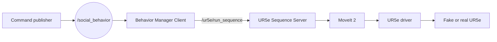
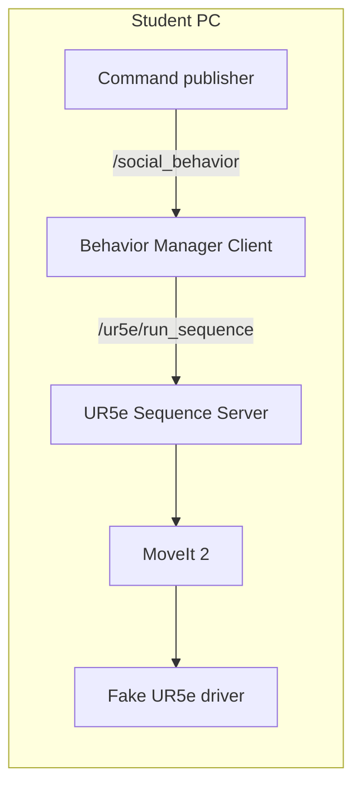
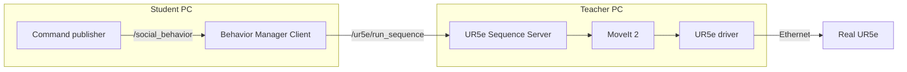

# Lab 1 — Social Motion with the UR5e

## 1. Objective

In this laboratory, you will create and execute a simple social movement for a UR5e robot.

Examples of social movements are:

* greeting;
* waving;
* inviting a person to approach;
* pointing toward an object;
* showing agreement;
* celebrating;
* asking a person to wait.

You will:

1. create a new YAML motion sequence;
2. test it at home using fake UR5e hardware;
3. activate it through the ROS 2 social behavior interface;
4. validate it in the laboratory with the real UR5e robot.

You do not need to modify the robot controller, the motion server or the behavior manager.

---

## 2. ROS 2 client-server architecture

The social behavior system uses two main ROS 2 communication mechanisms:

* a topic to publish the requested social behavior;
* a service to request the execution of the corresponding robot sequence.



The Behavior Manager Client does not execute the YAML file directly.

It sends only the sequence name to the UR5e Sequence Server.

For example:

```text
give5
```

The server locates the corresponding YAML file:

```text
give5
   ↓
give5.yaml
```

and executes it using MoveIt 2.

---

## 3. Student task

Create one original social movement for the UR5e.

The movement must:

* have a clear social meaning;
* contain several robot poses;
* start from a safe initial configuration;
* use smooth and slow movements;
* avoid singularities and joint limits;
* finish in a safe configuration;
* remain inside the permitted robot workspace.

Place the YAML file in:

```text
ur5e_motion_server/config/
```

Use a descriptive file name:

```text
wave.yaml
invite_person.yaml
show_agreement.yaml
celebrate.yaml
```

Do not use spaces or capital letters in the file name.

---

## 4. Design the movement

Before creating the YAML file, define:

* the social meaning of the movement;
* the intended human interpretation;
* the number of movement steps;
* the approximate duration;
* the initial and final robot configurations.

Recommended sequence:

```text
safe initial pose
        ↓
social gesture
        ↓
optional repetition
        ↓
safe final pose
```

Keep the robot velocity and acceleration low.

---

## 5. Create the YAML sequence

Create a new file:

```text
ur5e_motion_server/config/my_social_motion.yaml
```

Use one of the existing YAML files as a structural reference.

Do not modify an existing behavior. Copy it and give the new sequence a different name.

**Location of the YAML sequence**

The YAML file must be available on the computer running the UR5e Sequence Server.

At home, the client and server use the same workspace, so the student can add the YAML file directly to the local package.

In the laboratory, the final YAML file must be copied or integrated into the workspace of the teacher computer before execution.

The student client sends only the sequence name:

```text
my_social_motion
```

It does not send a local file path.

The server resolves the sequence name to a YAML file:

```text
my_social_motion
        ↓
my_social_motion.yaml
```

After editing the file, rebuild the workspace:

```bash
cd ~/UR5e_social_robotics
colcon build --symlink-install
source install/setup.bash
```

Open a new terminal and remember to source the workspace:

```bash
cd ~/UR5e_social_robotics
source install/setup.bash
```

---

## Home and laboratory configurations

### Home configuration

All ROS 2 nodes run on the same computer:



Although all nodes run on the same computer, the client and server remain independent ROS 2 nodes.

### Laboratory configuration

The nodes are distributed between two computers:



The student uses the same client commands at home and in the laboratory.

Only the location of the server and the type of robot hardware change.


# Part A — Home verification with fake hardware

## 6. Start the fake UR5e driver

Terminal 1:

```bash
source /opt/ros/humble/setup.bash
source ~/UR5e_social_robotics/install/setup.bash

ros2 launch ur_robot_driver ur_control.launch.py \
  ur_type:=ur5e \
  robot_ip:=192.168.0.20 \
  use_fake_hardware:=true \
  launch_rviz:=false
```

The IP address is required by the launch file but is not used to connect to a physical robot when fake hardware is enabled.

---

## 7. Start MoveIt 2 and RViz

Terminal 2:

```bash
source /opt/ros/humble/setup.bash
source ~/UR5e_social_robotics/install/setup.bash

ros2 launch ur_moveit_config ur_moveit.launch.py \
  ur_type:=ur5e \
  launch_rviz:=true
```

Verify in RViz that:

* the UR5e model is visible;
* the robot state is updated;
* MoveIt 2 is running;
* there are no collision warnings in the initial configuration.

---

## 8. Start the sequence server

Terminal 3:

```bash
source /opt/ros/humble/setup.bash
source ~/UR5e_social_robotics/install/setup.bash

ros2 run ur5e_motion_server ur5e_sequence_server
```

Verify that the service exists:

```bash
ros2 service list | grep ur5e
```

Expected service:

```text
/ur5e/run_sequence
```

Verify that the service type is correct:

```bash
ros2 service type /ur5e/run_sequence
```

You will see:

```text 
ur5e_interfaces/srv/RunSequence
```

Verify the server:

```bash
ros2 node info /ur5e_sequence_server
```

You will see the service:

```text
Service Servers:
  /ur5e/run_sequence
```

---

## 9. Start the social behavior manager

In the PC-student, open a new terminal and run the behavior manager.

Terminal 4:

```bash
source /opt/ros/humble/setup.bash
source ~/UR5e_social_robotics/install/setup.bash

ros2 launch social_robot_behaviors social_behavior.launch.py
```

Verify the node:
````bash
ros2 node info /behavior_manager_client_node
```

You have to see:

```text
Subscribers:
  /social_behavior

Service Clients:
  /ur5e/run_sequence
```

Verify that the node subscribes to the social behavior topic:

```bash
ros2 topic info /social_behavior
```

---

## 10. Execute the social movement

Terminal 5:

```bash
ros2 topic pub --once /social_behavior std_msgs/msg/String \
  "{data: 'my_social_motion'}"
```

Replace:

```text
my_social_motion
```

with the name configured for your YAML sequence.

Observe the movement in RViz.

---

## 11. Home verification checklist

Before coming to the laboratory, verify:

* the workspace builds without errors;
* the YAML file can be loaded;
* the behavior name is recognized;
* the sequence server receives the request;
* the robot completes all poses;
* there are no self-collisions;
* the movement is smooth;
* the movement starts and ends safely;
* the social meaning is understandable.

Record a short video of the movement in RViz.

---

# Part B — Laboratory verification with the real UR5e

## 12. Safety rules

Before operating the real robot:

* obtain authorization from the laboratory instructor;
* check that the robot workspace is clear;
* remain outside the robot workspace;
* know the location of the emergency stop;
* use reduced velocity and acceleration;
* never execute an untested YAML sequence;
* first verify the movement using fake hardware;
* keep one person ready to stop the robot.

The instructor must validate the first execution.

---

## 13. Connect to the robot network

Connect the computer to the same network as the UR5e.

Verify communication:

```bash
ping <UR5E_IP>
```

Replace `<UR5E_IP>` with the IP address provided by the instructor.

---

## 14. Start the real UR5e driver

Terminal 1:

```bash
source /opt/ros/humble/setup.bash
source ~/UR5e_social_robotics/install/setup.bash

ros2 launch ur_robot_driver ur_control.launch.py \
  ur_type:=ur5e \
  robot_ip:=<UR5E_IP> \
  use_fake_hardware:=false \
  launch_rviz:=false
```

The External Control program must be loaded and started from the UR5e teach pendant when instructed.

---

## 15. Start MoveIt 2

Terminal 2:

```bash
source /opt/ros/humble/setup.bash
source ~/UR5e_social_robotics/install/setup.bash

ros2 launch ur_moveit_config ur_moveit.launch.py \
  ur_type:=ur5e \
  launch_rviz:=true
```

Check that the robot position in RViz corresponds to the physical robot position.

Do not continue if both positions are inconsistent.

---

## 16. Start the motion server and behavior manager

Terminal 3:

```bash
ros2 run ur5e_motion_server ur5e_sequence_server
```

Now on PC-student launch the Client

Open a new Terminal 4:

```bash
ros2 launch social_robot_behaviors social_behavior.launch.py
```

---

## 17. Execute the movement on the real robot

Before publishing the command:

1. ask the instructor for authorization;
2. confirm that the workspace is clear;
3. confirm that the robot is in the expected initial pose;
4. reduce the speed using the robot speed slider.

Terminal 5:

```bash
ros2 topic pub --once /social_behavior std_msgs/msg/String \
  "{data: 'my_social_motion'}"
```

Observe:

* whether the real motion matches the simulated motion;
* whether the gesture is understandable;
* whether the movement is sufficiently smooth;
* whether the speed is appropriate for human interaction;
* whether the initial and final poses are safe.

---

## 18. ROS 2 inspection

Use the following commands to inspect the system:

```bash
ros2 node list
```

```bash
ros2 topic list
```

```bash
ros2 service list
```

```bash
ros2 topic info /social_behavior
```

```bash
ros2 service type /ur5e/run_sequence
```

Create a simplified ROS 2 computation graph showing:

```text
publisher
behavior manager
sequence server
MoveIt 2
UR driver
```

---

## 19. Deliverables

Submit:

1. the YAML motion file;
2. a short description of the social meaning;
3. a diagram of the ROS 2 architecture;
4. evidence of fake-hardware execution;
5. evidence of real-robot execution;
6. a brief comparison between simulation and real execution;
7. answers to the discussion questions.

---

## 20. Discussion questions

1. Why is the social command sent through a ROS 2 topic?

2. Why does the behavior manager use a service to request the execution?

3. What is the difference between a social behavior and a robot trajectory?

4. Why must the motion be tested with fake hardware before using the real robot?

5. How could the terminal publisher be replaced by a voice interface?

6. How could a 3D camera activate the same behavior?

7. Would a ROS 2 action be more appropriate than a service for long movements? Explain why.

---

## 21. Possible future extensions

The command publisher can later be replaced without modifying the motion server:

```text
Voice recognition
        ↓
/social_behavior
```

```text
Human gesture recognition
        ↓
/social_behavior
```

```text
RGB-D camera
        ↓
/social_behavior
```

```text
Graphical interface
        ↓
/social_behavior
```

```text
Large language model
        ↓
/social_behavior
```

All these interfaces can publish the same high-level behavior name.

This is one of the main advantages of a modular ROS 2 architecture.
